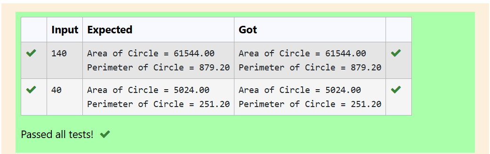
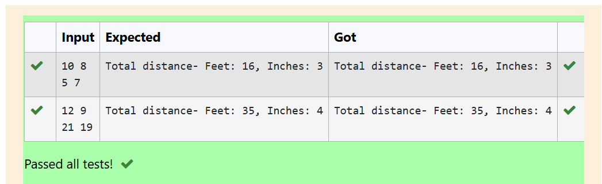
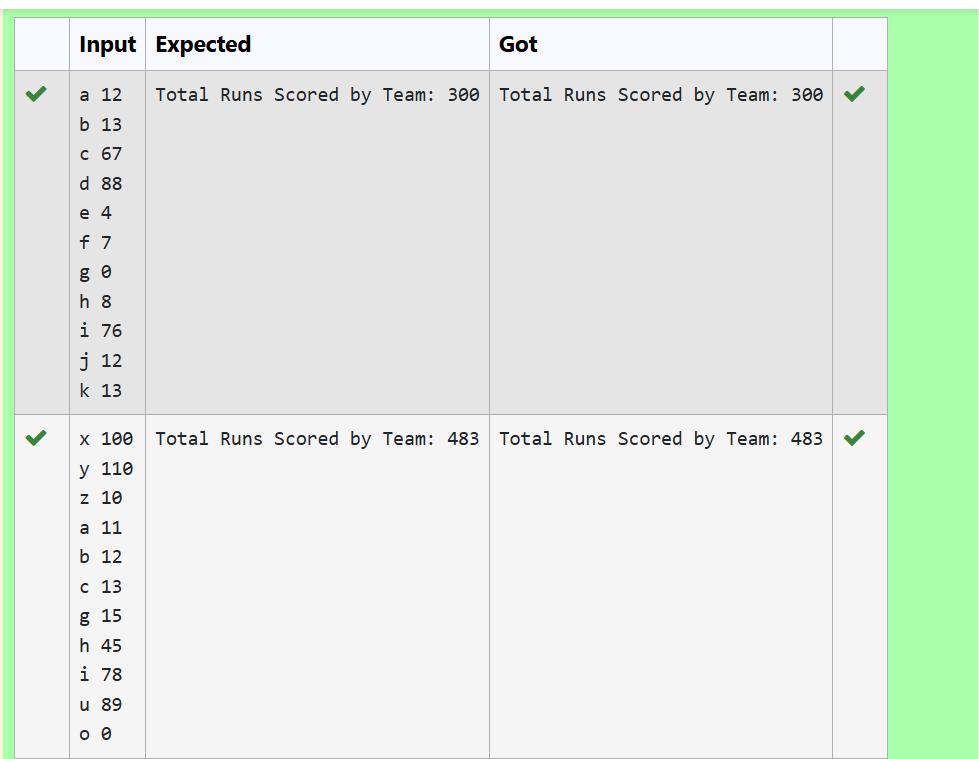
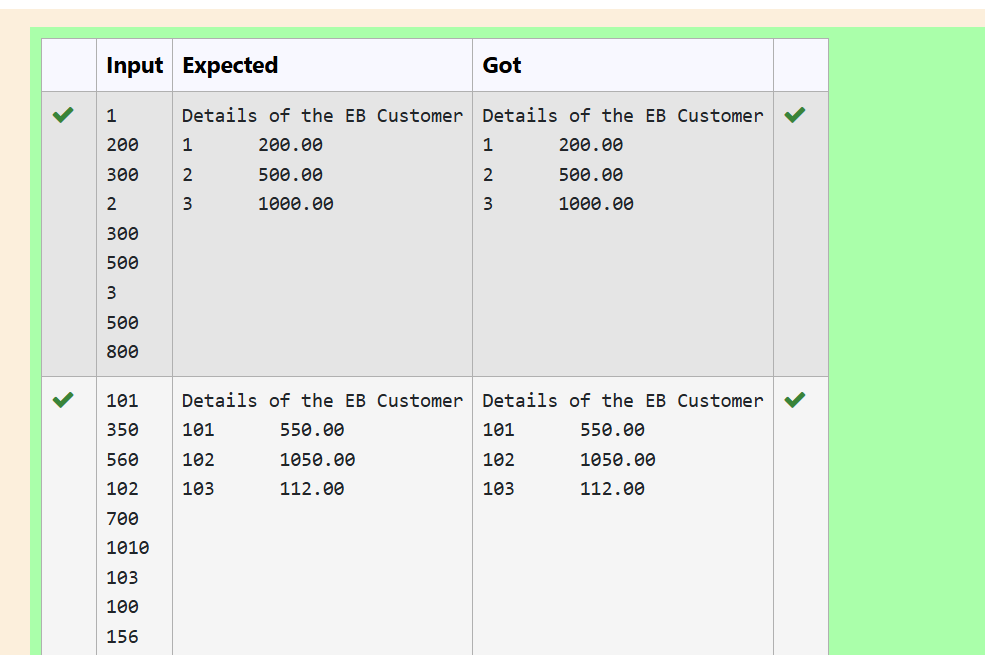

# MODULE-6
---
# EXP NO:26 C PROGRAM TO FIND AREA AND PERIMETER OF A CIRCLE USING POINTER

## Aim:

Write a C program to calculate the area and perimeter of a circle for a given radius, using a pointer to reference the radius value.

## Algorithm:

1. Start.

2. Include the necessary header file: stdio.h.

3. In the main function:

4. Declare a floating-point variable radius to store the input.

5. Declare a floating-point pointer *r and initialize it to point to the address of radius (&radius).

6. Read the radius value from the user using scanf and store it in radius.

7. Declare a constant floating-point variable pi and initialize it to 3.14.

8. Calculate the Area of the Circle using the formula: 
              $$Area = \pi \times r^2$$ 
9. In the program, this is calculated as pi * (*r) * (*r).

10. Calculate the Perimeter of the Circle using the formula: 
            $$Perimeter = 2 \times \pi \times r$$
11. In the program, this is calculated as 2 * pi * (*r).

12. Print the Area and Perimeter, formatted to two decimal places.

13. Stop.

## Program:
```
#include <stdio.h>

int main()
{
    float radius;
    scanf("%f", &radius);
    
    float *r = &radius;
    float pi = 3.14;
    
    printf("Area of Circle = %.2f", pi * *r * *r);
    printf("\nPerimeter of Circle = %.2f", 2 * pi * *r);
    
    return 0;
}
```

## Output:

## Result:

The C program to calculate the area and perimeter of a circle using a pointer was executed and verified successfully.

---
#
---
# EXP NO:27 C PROGRAM FOR DYNAMIC MEMORY ALLOCATION USING REALLOC()

## Aim:

Write a C program that uses the realloc() function to dynamically increase the size of an array of floating-point numbers, add new values to the expanded memory, and print all elements of the new list.

## Algorithm:

1. Start.

2. Include necessary header files: stdio.h and stdlib.h (for malloc and realloc).

3. In the main function:

4. Initial Allocation: Declare a floating-point pointer temp. Use malloc to allocate memory for 3 floating-point numbers and cast the result to float*.

5. Initialize the first three elements of temp with the values 12.33, 67.44, and 89.55.

6. Reallocation: Declare a new floating-point pointer arr. Call realloc(temp, 5 * sizeof(float)) to expand the allocated memory from 3 to 5 elements, and store the resulting pointer in arr. The original values are preserved in the first three positions.

7. Add New Values: Assign the new values, 20.21 and 32.67, to the newly allocated indices arr[3] and arr[4].

8. Print Values: Use a for loop to iterate from $i=0$ to $i<5$ and print all five floating-point values from the arr pointer, formatted to two decimal places.

9. Stop.

## Program:
```
#include <stdio.h>
#include <stdlib.h>

int main()
{
    float *temp = (float*)malloc(3 * sizeof(float));
    
    temp[0] = 12.33;
    temp[1] = 67.44;
    temp[2] = 89.55;
    
    float *arr = (float*)realloc(temp, 5 * sizeof(float));
    
    arr[3] = 20.21;
    arr[4] = 32.67;
    
    for (int i = 0; i < 5; i++)
    {
        printf("%.2f ", arr[i]);
    }
    
    return 0;
}
```

## Output:

## Result:

The C program demonstrating dynamic memory resizing and data preservation using the realloc() function was successfully executed and verified.

---
#
---
# EXP NO:28 C PROGRAM TO ADD DISTANCES USING STRUCTURES

## Aim:

Write a C program to define a structure to represent distances in feet and inches, read two such distances, add them together, and display the total distance in the standard format (where 12 inches equals 1 foot).

## Algorithm:

1. Start.

2. Include the necessary header file: stdio.h.

3. Define a structure named dis containing two integer members: feet and inch.

4. In the main function:

    - Declare an array of the structure dis, named d, of size 2, to store the two input distances.

    - Declare a structure variable f of type dis to store the final total distance (only the feet part is used initially).

    - Declare an integer variable i to hold the total inches.

5. Read the feet and inches for both distances (d[0] and d[1]) from the user.

6. Calculate the Total Feet by adding the feet components of the two input distances: f.feet = d[0].feet + d[1].feet.

7. Calculate the Total Inches by adding the inches components of the two input distances: i = d[0].inch + d[1].inch.

8. Normalization Check: Use an if statement to check if the total inches (i) are greater than 11 (meaning they exceed 1 foot).

9. If i > 11 (Normalization required):

    - Add the whole number of extra feet to f.feet: f.feet += (i / 12).

    - Update the inches (i) to the remainder: i -= (i / 12) * 12.

10. Print the final Total distance in feet and inches using the normalized values f.feet and i.

11. Stop.

## Program:
```
#include <stdio.h>

struct dis {
    int feet, inch;
} d[2];

int main()
{
    scanf("%d %d", &d[0].feet, &d[0].inch);
    scanf("%d %d", &d[1].feet, &d[1].inch);
    
    int f = d[0].feet + d[1].feet;
    int i = d[0].inch + d[1].inch;
    
    if (i > 11) {
        f += (i / 12);
        i -= (i / 12) * 12;
    }
    
    printf("Total distance- Feet: %d, Inches: %d", f, i);
    
    return 0;
}

```
## Output:

## Result:

The C program to add two distances expressed in feet and inches using user-defined structures was successfully executed and verified.

---
#
---
# EXP NO:29 C PROGRAM FOR CRICKET TEAM SCORE USING STRUCTURE

## Aim:

Write a C program to define a structure to store a cricket player's name and runs scored, read the data for 11 players, and calculate the total score achieved by the entire team.

## Algorithm:

1. Start.

2. Include the necessary header file: stdio.h.

3. Define a structure named ply (player) containing:

    - An integer member s (score).

    - A character array n[10] (name) for the player's name.

4. Declare a structure array p[11] of type ply to hold the data for 11 players.

5. In the main function:

    - Initialize an integer variable score to 0 to accumulate the total runs.

    - Use a for loop to iterate 11 times (for the 11 players, $i=0$ to $i<11$).

6. Inside the loop:

    - Read the player's name (p[i].n) and their score (p[i].s) from the user.

    - Add the current player's score to the running total: score += p[i].s.

7. After the loop completes, print the final calculated Total Runs Scored by Team:.

8. Stop.

## Program:
```
#include <stdio.h>
struct ply{
    int s;
    char n[10];
} p[11];

int main(){
    int score = 0;
    
    for (int i = 0; i < 11; i++){
        scanf("%s %d", p[i].n, &p[i].s);
        score += p[i].s;
    }
    
    printf("Total Runs Scored by Team: %d", score);
    
    return 0;
}
```

## Output:

## Result:

The C program to accept cricket batting information using structures and calculate the total team score was successfully executed and verified.

---
#
---

# EXP NO:30 C PROGRAM FOR ELECTRICITY BILL CALCULATION USING STRUCTURE

## Aim:

Write a C program using a structure to store customer details (number, previous reading, current reading) for 3 electricity board (EB) customers. The program must calculate the total units consumed and the final bill amount based on the following slab rates:

-   - $0$ to $100$ units: $\text{Rs } 2$ per unit
    - $101$ to $200$ units: $\text{Rs } 3$ per unit
    - Above $200$ units: $\text{Rs } 5$ per unit

## Algorithm:

1. Start.

2. Include the necessary header file: stdio.h.

3. Define a structure named eb (Electricity Board) containing:

    - n (customer number): integer

    - pr (previous reading): integer

    - cr (current reading): integer

    - u (units consumed): integer

    - r (rate/bill amount): float

4. Declare a structure array e[3] of type eb to hold data for 3 customers.

5. In the main function:

    - Data Input and Units Calculation: Use a for loop to iterate 3 times (for 3 customers).

        -  Inside the loop, read the customer number (e[i].n), previous reading (e[i].pr), and current reading (e[i].cr).

        - Calculate the units consumed: e[i].u = e[i].cr - e[i].pr.

    - Print the header: "Details of the EB Customer".

    - Bill Calculation and Output: Use a second for loop to iterate 3 times to calculate the bill for each customer and print the results.

        - Check the units consumed (e[i].u) using an if-else if-else ladder to apply the tariff slabs:

            - Slab 1 (Units $\leq 100$): e[i].r = e[i].u * 2.

            - Slab 2 (Units $\leq 200$): e[i].r = (100 * 2) + ((e[i].u - 100) * 3).

            - Slab 3 (Units $> 200$): e[i].r = (100 * 2) + (100 * 3) + ((e[i].u - 200) * 5).

        - Print the customer number (e[i].n) and the calculated bill amount (e[i].r), formatted to two decimal places.

6. Stop.

## Program:
```
#include <stdio.h>
struct eb{
    int n;
    int pr;
    int cr;
    int u;
    float r;
} e[3];

int main(){
    for (int i = 0; i < 3; i++){
        scanf("%d\n%d\n%d", &e[i].n, &e[i].pr, &e[i].cr);
        e[i].u = e[i].cr - e[i].pr;
    }
    
    printf("Details of the EB Customer\n");
    
    for (int i = 0; i < 3; i++){
        if (e[i].u <= 100) e[i].r = e[i].u * 2;
        else if (e[i].u <= 200) e[i].r = (100 * 2) + (e[i].u - 100) * 3;
        else e[i].r = (100 * 2) + (100 * 3) + (e[i].u - 200) * 5;
        
        printf("%d       %.2f\n", e[i].n, e[i].r);
    }
}
```

## Output:

## Result:

The C program to calculate electricity bills for multiple customers using structures and applying a three-tier tariff slab system was successfully executed and verified.

---